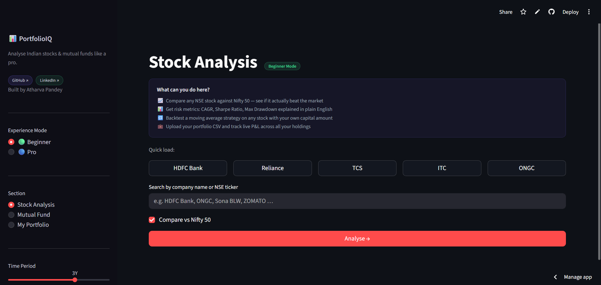
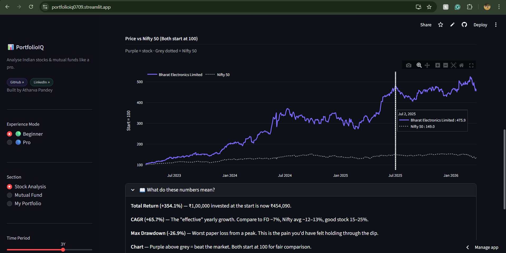
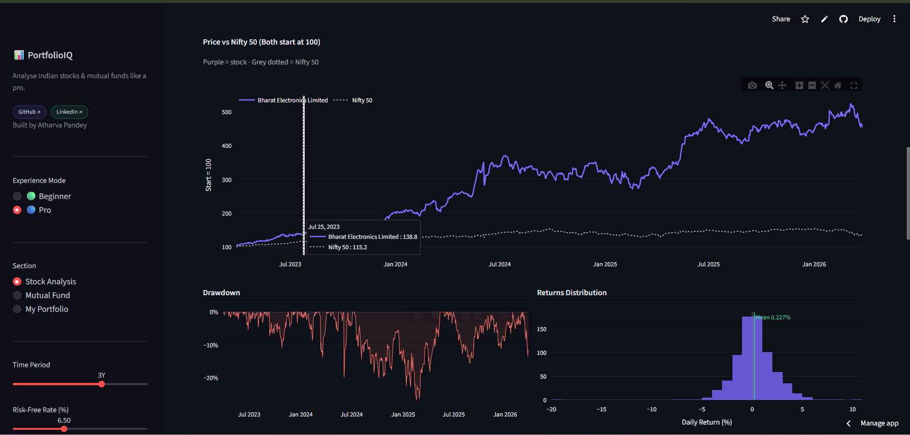
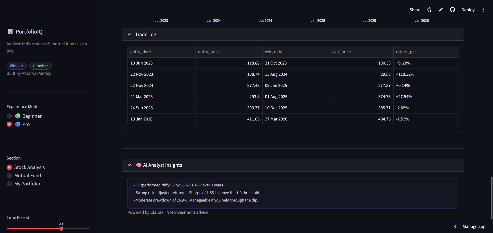

# PortfolioIQ 📊

**Indian Stock & Mutual Fund Analytics Dashboard**

Live demo → [portfolioiq0709.streamlit.app](https://portfolioiq0709.streamlit.app)

---

## What it does

Most retail investors in India have no easy way to answer basic questions: *Did this stock actually beat the market? How much risk did I take for those returns? Would a simple strategy have worked better?*

PortfolioIQ answers those questions. Enter any NSE stock or mutual fund, and get:

- **Benchmark comparison** — indexed-to-100 chart showing your stock vs Nifty 50 (or the fund's actual benchmark index)
- **Risk-return metrics** — CAGR, Sharpe Ratio, Max Drawdown, Volatility, Alpha, Beta — with plain-English explanations for each
- **SMA Crossover Backtest** — test a moving average strategy on any stock, see the trade log and equity curve
- **AI Analyst Insights** — powered by Claude, generates a concise analyst-style interpretation of the numbers
- **Portfolio tracker** — upload a CSV of your holdings, get live P&L, allocation chart, and portfolio vs Nifty comparison
- **Beginner / Pro mode** — simplified 3-metric view for newcomers, full suite for experienced investors

---
## Screenshots

### 🏠 Homepage
<p align="center">
  
</p>

---

### 📈 Stock vs Nifty Comparison
<p align="center">
  
</p>

---

### 📊 Key Metrics Dashboard
<p align="center">
  
</p>

---

### 🤖 AI Analyst Insights
<p align="center">
  
</p>

---

## Tech stack

| | |
|---|---|
| App framework | Streamlit |
| Stock data | yfinance (NSE/BSE via Yahoo Finance) |
| Mutual fund NAV | [mfapi.in](https://www.mfapi.in) — free Indian MF API |
| Data processing | pandas, numpy |
| Charts | Plotly |
| AI commentary | Anthropic Claude API |
| Deployment | Streamlit Cloud |

---

## Run locally

```bash
git clone https://github.com/atharvapandeyy/portfolioiq.git
cd portfolioiq
pip install -r requirements.txt
python -m streamlit run app.py
```

---

## Portfolio CSV format

```csv
ticker,shares,avg_buy_price
RELIANCE,10,2450.00
HDFCBANK,5,1580.00
IREDA,100,180.00
```

Use NSE ticker symbols. The app fetches live prices and calculates P&L automatically.

---

## Project structure

```
portfolioiq/
├── app.py                 # main dashboard UI
├── data/
│   └── fetcher.py         # data fetching: stocks, MF NAV, index data
├── analytics/
│   └── metrics.py         # CAGR, Sharpe, drawdown, SMA backtest engine
└── requirements.txt
```

---

## About

Built by **Atharva Pandey** — final year B.E. IT student at Thakur College of Engineering & Technology, Mumbai. I'm interested in the intersection of finance and technology. The financial metrics in this project: Sharpe Ratio, Alpha/Beta & Max Drawdown are concepts from the CFA Level 1 curriculum that I'm currently working through independently alongside my engineering degree.

The financial metrics in this project (Sharpe Ratio, Alpha/Beta, SMA backtesting) are concepts I've been studying independently alongside my engineering degree.

[LinkedIn](https://linkedin.com/in/atharva-pandey-600826322) · [GitHub](https://github.com/atharvapandeyy)

---

*Data sourced from Yahoo Finance and mfapi.in. Not investment advice.*
